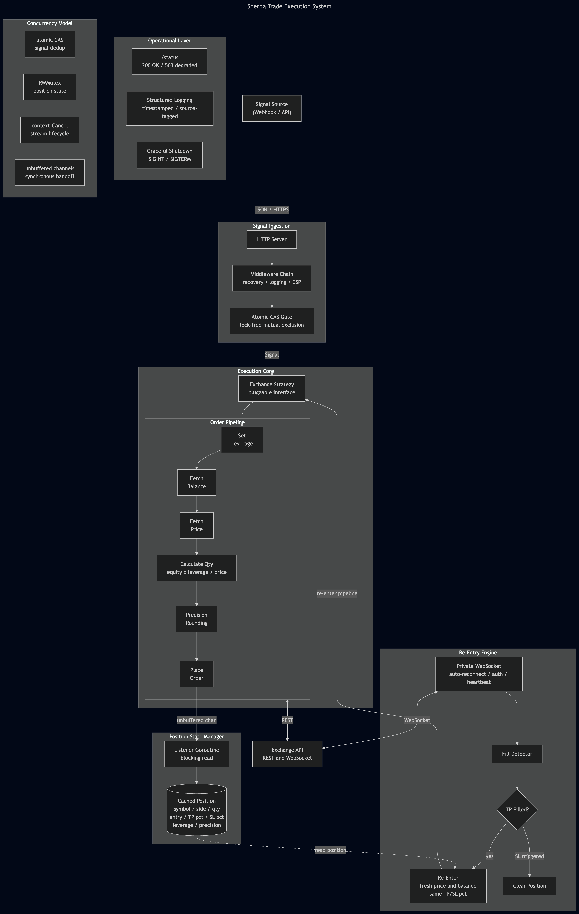

# Sherpa

Initial prototype for a Rust production system processing millions in monthly volume.

Built in Go. Ingests external signals over HTTPS, executes leveraged futures orders against exchange APIs, and automatically re-enters positions on take-profit fills via persistent WebSocket streams.

## Architecture



**Core components:**

- **Signal Ingestion**: HTTP server with middleware chain and lock-free atomic CAS gate ensuring single-signal-in-flight processing
- **Execution Core**: Pluggable exchange strategy interface fronting a deterministic order pipeline (leverage, balance, price, quantity calculation, precision rounding, placement)
- **Position State Manager**: Goroutine listener with synchronous unbuffered channel handoff, caches live position metadata
- **Re-Entry Engine**: Persistent authenticated WebSocket with auto-reconnect and heartbeat. Detects take-profit fills, re-enters the pipeline with fresh market data and original risk parameters
- **Operational Layer**: Health endpoint with degraded-state detection (200/503), structured logging, graceful shutdown on SIGINT/SIGTERM

## Design Decisions

| Decision                                                  | Rationale                                                             |
| --------------------------------------------------------- | --------------------------------------------------------------------- |
| `atomic.CompareAndSwap` over `sync.Mutex` for signal gate | Lock-free on the hot path, zero contention                            |
| Unbuffered channels for order handoff                     | Explicit backpressure, no silent drops                                |
| Balance + price refetched on every re-entry               | Position sizing reflects realised PnL, not stale state                |
| Instrument info cached per-symbol (`sync.RWMutex`)        | Avoid redundant API calls on re-entry without sacrificing correctness |
| `context.WithCancel` for price stream lifecycle           | Scoped teardown, no leaked goroutines                                 |
| Leverage set before quantity calculation                  | Margin requirement must be known before sizing                        |

## Concurrency Model

```
Signal ──► atomic CAS (int32) ──► pipeline goroutine
                                        │
                                  unbuffered chan
                                        │
                                  listener goroutine ──► cached state (RWMutex)
                                                              │
                                                        WebSocket goroutine
                                                        (reconnect loop)
                                                              │
                                                        fill detected
                                                              │
                                                   re-enter ──► pipeline
```

Goroutines: HTTP server, 2 order listeners (always running), WebSocket reconnect loop + ping ticker, temporary price streams on re-entry (cancelled via context).

## Build & Run

```bash
go build -o sherpa ./cmd/web

./sherpa -exchange bybit -env prod -addr :4000 -reEntrySwitch=true
```

| Flag             | Default  | Description                                 |
| ---------------- | -------- | ------------------------------------------- |
| `-exchange`      | required | Target exchange                             |
| `-env`           | required | `test` or `prod`                            |
| `-addr`          | `:4000`  | HTTP listen address                         |
| `-reEntrySwitch` | `false`  | Enable WebSocket-driven re-entry on TP fill |

## Test

```bash
go test ./...
```
